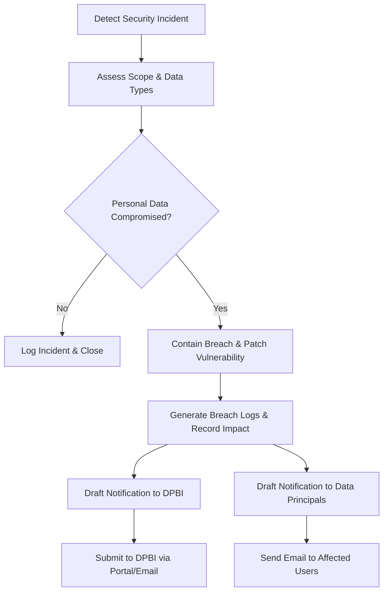

# Personal Data Breach Runbook (DPDP Act 2023 - India)

This runbook outlines the procedure to follow in the event of a personal data breach under India's Digital Personal Data Protection (DPDP) Act 2023.

---

## 1. Statutory Obligation & Provisional Timelines

> [!WARNING]
> Under Section 8(6) of the DPDP Act 2023, in the event of a personal data breach, the Data Fiduciary (Zenlio) must give notice of such breach to the **Data Protection Board of India (DPBI)** and each affected **Data Principal** (user).
> 
> **Timeline Warning**: The exact timeline for breach notifications is to be prescribed by the (still-finalizing) **DPDP Rules**. Current draft rules reference **"without delay"** for the initial notification, with fuller details to be submitted **within 72 hours** of detecting the breach. This timeline is **provisional and pending final notified rules**, not settled law. All actions must be taken with extreme urgency.

---

## 2. Breach Response Procedure



1. **Detection & Containment**: Identify how the breach occurred (e.g. Resend account compromise, SMTP interception, unauthorized access to target inbox `contact@zenlio.agency`). Revoke compromised API keys/tokens and secure the inbox.
2. **Assessment**: Audit the Resend logs to determine the number of affected Data Principals and the types of personal data exposed (Names, Emails, Phone numbers, Message texts).
3. **Notification**:
   - Notify the **DPBI** using the template in Section 3.
   - Notify the **affected Data Principals** using the template in Section 4.

---

## 3. DPBI Notification Template

*To be submitted through the official DPBI digital portal or designated email address once active.*

```text
Subject: Notice of Personal Data Breach under Section 8(6) of DPDP Act 2023

To:
The Data Protection Board of India (DPBI)

Pursuant to Section 8(6) of the Digital Personal Data Protection Act 2023, we, Zenlio, acting as the Data Fiduciary, hereby notify the Board of a personal data breach.

1. DATA FIDUCIARY DETAILS
- Name of Entity: Zenlio
- Address: San Francisco, CA (Website operation globally, catering to users in India)
- Grievance / Compliance Officer: Mr. Rajesh Kumar (grievance@zenlio.agency)

2. DESCRIPTION OF THE BREACH
- Date and Time of Detection: [Insert Date & Time, e.g., 2026-08-16T14:00:00Z]
- Nature of the Breach: [Insert details, e.g., Unauthorized access to transactional email routing logs / Resend API key exposure]
- Categories of Personal Data Involved: Contact Form inputs (Names, Email addresses, Phone numbers, and message content)
- Estimated Number of affected Data Principals in India: [Insert number, e.g., 120]

3. POTENTIAL CONSEQUENCES & RISK ASSESSMENT
- The exposed data is limited to inquiry messages and contact details. There is a low risk of financial fraud, but a moderate risk of targeted phishing or spam communications.

4. REMEDIAL MEASURES TAKEN
- Compromised credentials / Resend API keys were revoked immediately.
- Enforced strict Multi-Factor Authentication (MFA) on the email inbox routing target.
- Formulated an audit of all active API tokens.

5. CONTACT POINT FOR FURTHER DETAILS
- Name: Mr. Rajesh Kumar
- Role: Grievance Officer
- Email: grievance@zenlio.agency
```

---

## 4. Affected User Notification Template

*To be sent individually via email to each affected Data Principal without delay.*

```text
Subject: Important Notice Regarding Your Personal Data - Zenlio

Dear [User Name],

We are writing to inform you of a security incident that may have involved some of the personal information you submitted to us through our contact form.

Under the Digital Personal Data Protection (DPDP) Act 2023 of India, we are committed to keeping you informed of any events affecting your data privacy.

What Happened?
On [Insert Date], we detected a security incident involving unauthorized access to our transactional email service logs. This service is used to route contact form submissions to our team.

What Information Was Involved?
The incident may have exposed the details you entered in our contact form:
- Your Name
- Your Email Address
- Your Phone Number (if provided)
- The text of the message you submitted

What We Have Done:
We took immediate action to secure our systems:
- We rotated all secret API keys and tokens.
- We audited access logs to confirm no further systems were affected.
- We have notified the Data Protection Board of India (DPBI).

What You Can Do:
While we have no evidence that your information has been misused, we recommend that you remain vigilant against unsolicited communications, spam, or phishing attempts that reference your inquiry with Zenlio.

Your Rights:
Under the DPDP Act, you have the right to request the erasure of your contact submission data or withdraw your consent for further communication. To exercise these rights, please visit our Data Rights portal at: https://zenlio.agency/data-rights or contact our Grievance Officer.

Grievance Redressal:
If you have any questions or require assistance regarding this incident, you can reach our Grievance Officer:
- Name: Mr. Rajesh Kumar
- Email: grievance@zenlio.agency

Sincerely,
The Zenlio Team
```
