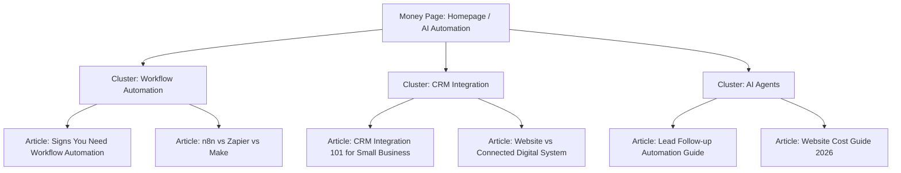

# Zenlio SEO, AEO, & GEO Growth Strategy

This document outlines the strategic roadmap to optimize the Zenlio agency website for traditional search engines (Google), answer engines (ChatGPT, Claude), and generative search tools (Gemini, Google SGE).

---

## 1. Current SEO State & Target Audience

### Current State
The website has high-performance code, custom animations, and clean copy. However, it lacks fundamental search integrations:
- No `robots.txt` or `sitemap.xml`.
- No canonical tags or structured JSON-LD schemas.
- Non-optimized metadata (all subpages inherit the generic homepage title and description).
- Dynamic blog posts lack specific metadata, leading to duplicates.

### Target Audience
Small-to-medium businesses (SMBs) and high-value professional practices ready to scale operations without increasing headcount. Key niches include:
- Dental clinics & medical practices
- Real estate agencies
- Architecture & interior design studios
- Boutique law firms

---

## 2. Core Service Offerings & Keywords

We focus search targeting on Zenlio's actual capabilities (Web Design, n8n automation, and CRM integrations).

### A. Core Keywords
- **Primary Keyword**: `AI automation agency`
- **Secondary Keywords**: `AI workflow automation services`, `Next.js development agency`, `business process automation consultants`, `n8n automation developers`, `CRM integration services`

### B. Localized India Targeting
- **Local Keywords**: `AI automation agency India`, `website development agency Hyderabad`, `workflow automation company Hyderabad`

---

## 3. Keyword-to-Page Map

| Page / Route | Primary Keyword | Secondary Keywords | Search Intent |
| :--- | :--- | :--- | :--- |
| **Homepage (`/`)** | `AI automation agency` | `AI workflow automation services`, `Next.js web development agency`, `business automation company` | Commercial / Transactional |
| **Blog Index (`/blog`)** | `AI automation insights` | `workflow automation articles`, `CRM integration tutorials`, `automation guides` | Informational |
| **Contact Page (`/contact`)** | `AI automation consultants` | `hire AI automation developer`, `book systems audit`, `Zenlio contact` | Transactional |
| **Privacy Policy (`/privacy`)** | `Zenlio privacy policy` | `DPDP Act compliance policy` | Navigational |
| **Cookies Policy (`/cookies`)** | `Zenlio cookie policy` | `cookie consent settings` | Navigational |
| **Data Rights (`/data-rights`)** | `Data rights request portal` | `DPDP data principal rights` | Navigational |

---

## 4. Content Clusters

We organize our educational and supporting content in structured clusters around Zenlio's primary money pages.

---

## 5. Technical SEO & Schema Strategy

### A. Canonicals & Robots
- Enforce lowercase canonical URLs on all server-rendered pages.
- Exclude internal API routes (`/api/`) in `robots.txt`.

### B. Structured Data (JSON-LD)
We implement the following schemas to increase Google Rich Results visibility and entity mapping:
- **Organization**: Maps the company name, logo, social profiles, and Hyderabad locality.
- **WebSite**: Sets the search target.
- **FAQPage**: Generated dynamically on the homepage using active FAQ entries to earn accordion features in search results.
- **Article**: Dynamically outputted for each blog post using title, author, date, and description tags.

---

## 6. AEO & GEO (AI Search Visibility)

AI models like ChatGPT and Claude compile search answers by evaluating entity relationships and topical clarity. We optimize for this by:
1. **Definition Blocks**: Using clear, direct definitions of what Zenlio does and who we serve.
2. **Entity Consistency**: Maintaining uniform naming of the agency ("Zenlio"), the Grievance Officer, and Hyderabad-based operations across the footer, contact, and privacy pages.
3. **Structured Terminology**: Standardizing tool references (e.g. Next.js, n8n, React, Tailwind CSS) to assist entity graphs.

---

## 7. 90-Day SEO Roadmap

### Days 1–30 (Technical & Foundations)
- Implement `robots.ts` and `sitemap.ts`.
- Set page-specific metadata for all static and dynamic pages.
- Add Organization, WebSite, FAQPage, and Article structured JSON-LD schemas.
- Refactor client pages to server components to enable metadata exports.

### Days 31–60 (Content & Topical Authority)
- Refine existing blog post content for targeted keywords.
- Optimize images for alt attributes and load speed.
- Address any crawl errors or console warnings.

### Days 61–90 (GEO & Conversion)
- Expand the portfolio showcase.
- Track search and AI citation rankings.
- Audit form-to-lead conversion flows.
